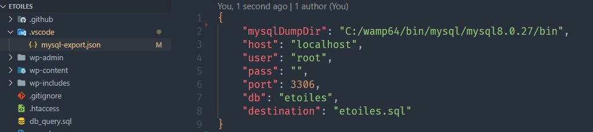

# One-Click MySQL Export

Export mysql database in one click from vscode.

## Usage

Create a JSON configuration file inside your project folder in the following structure:-
`YOUR_FOLDER/.vscode/mysql-export.json`

Define your MySQL server configuration in that JSON file.

When you want to export, Click on `Export MySQL` from status bar or open command palette, type `Export MySQL` and hit enter.

### Configuration Options

- `exporter` - Which exporter to use. values can be (`mysqldump` or `mysqldump-npm`). Default is `mysqldump-npm`.
        
      `mysqldump` is the default exporter that comes with mysql.
      `mysqldump-npm` will use a node.js package for exporting sql.

- `mysqlDumpDir` - Specify the mysqldump executable folder path if you are using `mysqldump` as exporter. Default: `C:/wamp64/bin/mysql/mysql8.0.27/bin`. Not necessary to specify if you are using the default `mysqldump-npm` as exporter.

- `useCustomCommand` - Whether or not you want to use your custom command. Applicable when using `mysqldump` as exporter. Default is `false`. If you set it to `true`, you must specify `customCommand` option and the rest of the options (host, user, pass, port, db, destination) will not be necessary. Not necessary to specify if you are using the default `mysqldump-npm` as exporter.

- `customCommand` - Your custom mysqldump command. Example: `mysqldump -h 127.0.0.1 -u root -p --default-character-set utf8mb4 mess > c:\wamp64\www\etoiles\etoiles.sql`. You will be promted to provide the db password afterwards. Not necessary to specify if you are using the default `mysqldump-npm` as exporter.

- `host`
- `user`
- `pass`
- `port`
- `db`

- `destination` - Where and in which name you want to save the exported file. Default: `db.sql`

---

### Found any bugs? Got any questions or ideas?

- Rise a ticket [here](https://github.com/MehbubRashid/vscode-one-click-mysql-export/issues) or feel free to create Pull Requests!
---

## Version history
- 0.1.0 - First version containing all basic features
